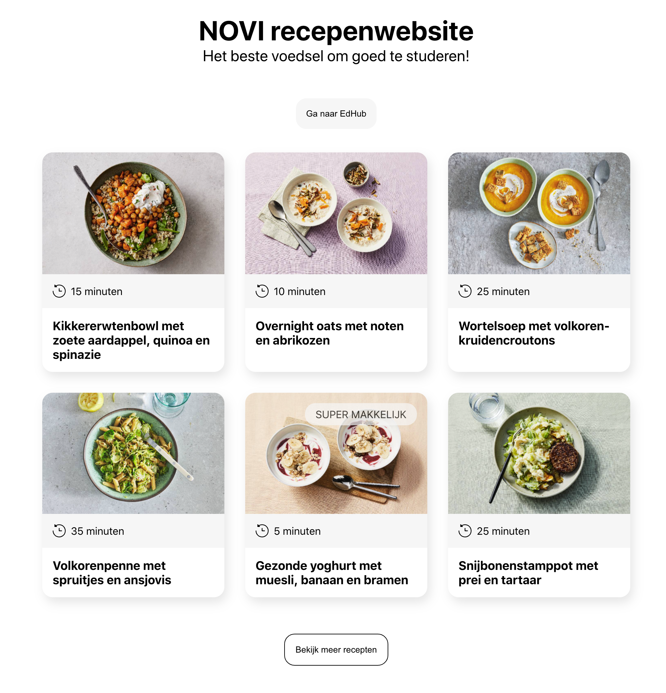

# Opdrachtbeschrijving

## Inleiding
Deze opdracht geeft je de mogelijkheid om te oefenen met enkele methoden die styling in een grote applicatie makkelijker maken, zoals
CSS Modules, BEM en SASS.

Het project is opgezet met [Create React App](https://github.com/facebook/create-react-app).

## Eindresultaat
Uiteindelijk zal de applicatie er niet anders uit gaan zien, je veranderd slechts iets aan de code waardoor alles beter gestructureerd is.
De applicatie ziet er zo uit:

## De applicatie starten
Als je het project gecloned hebt naar jouw locale machine, installeer je eerst de node_modules door het volgende commando in de terminal te runnen:

`npm install`

Wanneer dit klaar is, kun je de applicatie starten met behulp van:

`npm start`

of gebruik de WebStorm knop (npm start). Open http://localhost:3000 om de pagina in de browser te bekijken. 
Begin met het maken van wijzigingen in `src/App.js`: elke keer als je een bestand opslaat, zullen de wijzigingen te zien zijn op de webpagina.

## Plan de campagne
1. Implementeer CSS Modules
2. Implementeer een BEM systeem in de namen van de klassen
3. Implementeer SASS:
    * Zet alle bestanden om naar SCSS
    * Vervang de kleuren en andere onderdelen die veel terugkomen door variabelen
    * Vervang de media-query door een mixin-media query